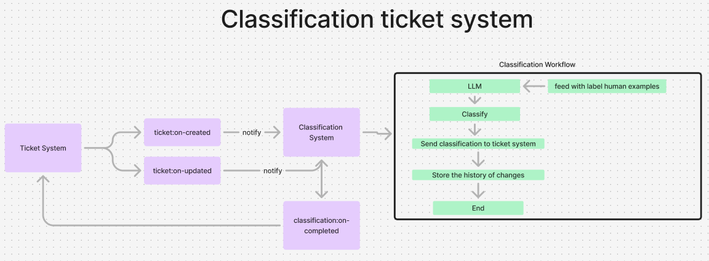

# Classification System with LLM (GPT-4o)

## Table of Contents
- [Overview](#overview)
- [Features](#features)
- [Architecture](#architecture)
- [Installation](#installation)
- [Usage](#usage)
- [Scripts](#scripts)
- [Improvements](#improvements)
- [Contributing](#contributing)
- [License](#license)

## Overview

The **Classification System with LLM** is a Node.js application designed to automatically classify customer support tickets using Large Language Models (LLMs). Leveraging OpenAI's GPT models, the system categorizes tickets, determines sentiment, and assigns priority levels, thereby streamlining the ticket management process and enhancing customer support efficiency.

## Features

- **Automatic Ticket Classification**: Categorizes tickets into predefined categories such as Order Issues, Payment Issues, Delivery Issues, etc.
- **Sentiment Analysis**: Determines the sentiment of the ticket (e.g., Happy, Angry, Neutral).
- **Priority Assignment**: Automatically assigns priority levels based on ticket content and sentiment.
- **Event-Driven Architecture**: Utilizes an event bus to handle ticket creation, updates, and classification completions.
- **Extensible and Modular**: Designed with scalability in mind, allowing for easy addition of new features and improvements.

## Architecture



The system employs a modular and event-driven architecture comprising the following components:

- **Entities**: Defines data structures for tickets and classifications using Zod schemas (`src/entities/ticket.ts`).
- **Services**:
  - `TicketService` (`src/services/ticket-service.ts`): Manages ticket creation, updates, and retrieval.
  - `ClassificationService` (`src/services/classification-service.ts`): Handles the classification pipeline, including category, sentiment, and priority determination.
- **Prompts**: Contains prompt templates for interacting with the OpenAI API to classify tickets (`src/prompts/`).
- **Utilities**:
  - `eventBus` (`src/utils/eventBus.ts`): Facilitates communication between different parts of the system using events.
- **Configuration**: Managed via environment variables (`.env`), TypeScript configurations (`tsconfig.json`), and ESLint for code quality (`eslint.config.mjs`).

## Installation

1. **Clone the Repository**
```bash
git clone https://github.com/0xthierry/event-driven-ticket-classification-gpt4o.git
cd event-driven-ticket-classification-gpt4o
```

2. **Install Dependencies**
Ensure you have [Node.js](https://nodejs.org/) installed.

```bash
pnmp install
```

3. **Configure Environment Variables**
Create a `.env` file in the root directory and add your OpenAI API key:

```env
OPENAI_API_KEY=your_openai_api_key
```

## Usage

1. **Build the Project**
```bash
pnmp run build
```

2. **Start the Application**
```bash
pnmp start
```

The application will start and listen for events related to ticket creation and updates.

## Scripts

- **Build**

Compiles the TypeScript code using `tsup`.

```bash
pnmp run build
```

- **Start**

Starts the application using `tsx`.

```bash
pnmp start
```

- **Lint**

Runs ESLint to analyze code quality.

```bash
pnmp run lint
```

- **Lint:fix**

Automatically fixes linting errors where possible.

```bash
pnmp run lint:fix
```

## Improvements

The project has several areas identified for future enhancements:

- **Classification Pipeline Abstraction**

  Implement a pipeline abstraction to allow adding multiple steps to the classification process, enhancing modularity and scalability.

- **Few-Shot Examples in Prompts**

  Enhance the ticket classification prompts with few-shot examples based on user feedback to improve classification accuracy.

- **Expand Classification Categories**

  Add more detailed or additional categories to cover a broader range of ticket types.

- **Manual Classification Override**

  Provide an interface or mechanism to manually override classifications when automatic classification is incorrect.

- **Error Handling and Logging**

  Improve error handling mechanisms and implement more robust logging for better observability.

## Contributing

Contributions are welcome! Please open an issue or submit a pull request for any enhancements or bug fixes.

## License

This project is licensed under the ISC License. See the [LICENSE](LICENSE) file for details.
